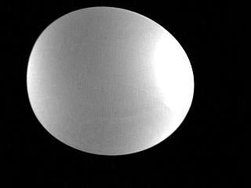
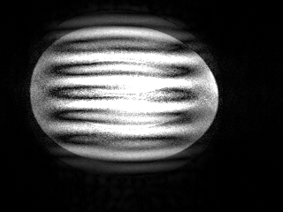

#  Variational Network (VarNet) Image Reconstruction
This code implements a variational network for image reconstruction as described by Sriram A *et al* in [End-to-End Variational Networks for Accelerated MRI Reconstruction](https://arxiv.org/abs/2004.06688).

## Input Data
This app takes as undersampled raw k-space data as input and outputs VarNet reconstructed images.  Auto-calibration signal (ACS) data from a fully-sampled central k-space with integrated reference lines is required.  Multi-slice data are supported.

A test data set is provided in the app container at ``/test_data/t1_tse_R6.mrd``, a T1-weighted TSE sequence with R=6 uniform acceleration and 26 in-place auto-calibration signal (ACS) lines acquired on 18 slices in a phantom at 1.5T.  It contains two datasets:
* ``dataset_1``, an adjustment scan containing noise calibration data
* ``dataset_2``, k-space data from the TSE sequence

## Supported Configurations
The ``varnet`` config is used for this workflow.  The acceleration rate and size of the ACS region can be retrospectively downsampled by appending ``_Rx`` or ``_ACSy`` where ``x`` is the acceleration rate and ``y`` is the number of ACS lines.  For example, a config of ``varnet_R8_ACS24`` indicates retrospective downsampling to rate 8 acceleration with 24 ACS lines.

## Running the app
This MRD app can be downloaded from Docker Hub at https://hub.docker.com/r/kspacekelvin/varnet-mrd-app.  In a command prompt on a system with [Docker](https://www.docker.com/) installed, download the Docker image:
```
docker pull kspacekelvin/varnet-mrd-app
```

Start the Docker image with the container name ``varnet-app``, a local folder named ``~/data`` mounted inside the container at ``/data``, and port 9002 shared:
```
docker run --rm --name varnet-app -v ~/data:/data -p 9002:9002 kspacekelvin/varnet-mrd-app
```

In another window, use an MRD client such as the one from the [python-ismrmrd-server](https://github.com/kspaceKelvin/python-ismrmrd-server#11-reconstruct-a-phantom-raw-data-set-using-the-mrd-clientserver-pair).  A copy is included in the app.

Start another terminal inside the Docker started above:
```
docker exec -it varnet-app bash
```

Run the client and send the data to the server:
```
python3 /opt/code/python-ismrmrd-server/client.py -c varnet -o /data/t1_tse_R6_varnet.mrd -g dataset_2 /test_data/t1_tse_R6.mrd
```

The output file (e.g. ``t1_tse_R6_varnet.mrd``) contains VarNet reconstructed images stored in the ``~/data`` folder.  Reconstructed images can be viewed with tools such as the [ismrmrdviewer](https://github.com/ismrmrd/ismrmrdviewer) or by converting to GIF using [mrd2gif](https://github.com/kspaceKelvin/python-ismrmrd-server/blob/master/mrd2gif.py), which is included in this app:
```
python3 /opt/code/python-ismrmrd-server/mrd2gif.py /data/t1_tse_R6_varnet.mrd
```

An animated .GIF file is created in the same folder:



The phantom data can also be reconstructed using standard GRAPPA using the [Gadgetron](https://github.com/gadgetron/gadgetron/) which can also [be used as an MRD App](https://github.com/kspaceKelvin/Gadgetron-SNR-MRD-App).  Download the Gadgetron Docker image:
```
docker pull ghcr.io/gadgetron/gadgetron/gadgetron_ubuntu_rt_nocuda
```

In another terminal, start the Gadgetron server mapping port 9003 on the host to port 9002 inside the container:
```
docker run --rm -p 9003:9002 ghcr.io/gadgetron/gadgetron/gadgetron_ubuntu_rt_nocuda
```

In the window above where the client was previous run, re-run the client and send the data to Gadgetron.  Note that both the noise and actual data must be sent in order to do SNR scaled reconstruction.
```
python3 /opt/code/python-ismrmrd-server/client.py -a host.docker.internal -p 9003 -c default_measurement_dependencies.xml -g dataset_1 /test_data/t1_tse_R6.mrd
python3 /opt/code/python-ismrmrd-server/client.py -a host.docker.internal -p 9003 -c Generic_Cartesian_Grappa_SNR.xml -o /data/t1_tse_R6_gadgetron.mrd -g dataset_2 /test_data/t1_tse_R6.mrd
```

Create a .GIF of the GRAPPA reconstructed images:
```
python3 /opt/code/python-ismrmrd-server/mrd2gif.py /data/t1_tse_R6_gadgetron.mrd
```


When processing is complete, the Docker container can be stopped by running:
```
docker kill varnet-app
```